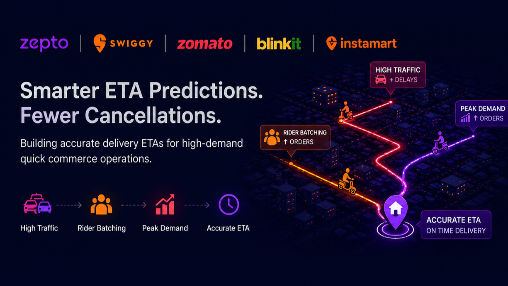

# 🚀 Quick Commerce Delivery Performance Analytics

  

# 📌 EXECUTIVE SUMMARY

This project analyzes delivery operations for a quick commerce platform (Zepto use case) to understand the operational factors influencing delivery performance and customer experience. Using SQL and Python, the project focuses on extracting, cleaning, validating, and analyzing delivery data to uncover actionable business insights across rider batching, traffic conditions, delivery distance, and peak-hour demand.

Based on the insights generated through business and data analytics, predictive analytics was performed as an additional step to estimate delivery times more accurately and evaluate operational performance.

- 🎯 **Business Problem:** Identify operational bottlenecks affecting delivery performance, ETA accuracy, and customer experience.
- 📊 **Analytics Approach:** SQL-based data extraction, exploratory data analysis, operational segmentation, KPI analysis, and root cause analysis.
- 🤖 **Predictive Analytics:** Built an ETA prediction model that reduced **Mean Absolute Error (MAE)** from **4.18 to 0.75 minutes (82% improvement)**.

---

# 🧠 BUSINESS PROBLEM

Quick commerce relies on fast and reliable deliveries to deliver an exceptional customer experience. Delayed deliveries directly impact customer satisfaction, SLA adherence, rider utilization, and operational efficiency.

The objective of this project is to analyze delivery operations, identify the operational factors driving delivery delays, and generate actionable business recommendations. After understanding these delivery patterns through data analysis, predictive analytics was introduced as an additional analytical component to estimate delivery times more accurately.

---

# 🛠️ METHODOLOGY

- 🗄️ **Data Extraction (SQL):**
  - Joins across orders, deliveries, riders, and stores
  - Aggregations and CTEs for structured analytical dataset creation

- 🐍 **Data Processing (Python):**
  - Data cleaning and validation
  - Data transformation
  - Feature preparation

- 🔍 **Exploratory Data Analysis:**
  - Delivery performance analysis
  - Operational KPI analysis
  - Trend identification
  - Root cause analysis

- 📊 **Operational Segmentation:**
  - Distance buckets (Short / Medium / Long)
  - Traffic levels (Low / Medium / High)
  - Peak vs Non-Peak demand
  - Rider batching analysis

- 🤖 **Predictive Analytics (Final Step):**
  - Built an ETA prediction model after completing business and operational analysis
  - Compared multiple predictive approaches using Mean Absolute Error (MAE)
  - Selected the best-performing model for delivery time estimation

---

# 🧩 SKILLS

### 🗄️ SQL
- CTEs
- Joins
- Aggregations
- Data Preparation
- Business Querying

### 🐍 Python
- Pandas
- NumPy
- Data Cleaning
- Data Validation
- Exploratory Data Analysis
- Feature Engineering

### 📊 Business Analytics
- KPI Analysis
- Root Cause Analysis
- Operational Analytics
- Trend Analysis
- Performance Analysis

### 📈 Predictive Analytics
- Regression Modeling
- Model Evaluation (MAE)
- Error Analysis

### 📊 BI Tools
- Power BI (Conceptual KPI Design & Visualization Thinking)

---

# 📊 RESULTS & BUSINESS RECOMMENDATIONS

The analysis identified several operational factors contributing to delivery delays. Rider batching, traffic conditions, delivery distance, and peak-hour demand were found to have the greatest impact on delivery performance. These insights formed the foundation for practical business recommendations aimed at improving operational efficiency.

Building on these analytical findings, a predictive ETA model was developed as an additional analytical component, reducing prediction error from **4.18 minutes to 0.75 minutes (82% improvement)**.

### 🔥 Key Insights

- Delivery time increases **non-linearly with rider batching (~45% increase from 1 → 3 orders)**
- **High traffic + high batching** creates worst-case delivery delays
- ETA prediction errors are higher during complex operational scenarios involving multiple interacting factors
- Delivery distance remains the strongest driver of overall delivery time

### 📌 Behavioral Findings

- Distance is the primary driver of delivery time
- Rider batching has a greater operational impact than expected
- Traffic effects become more significant when combined with operational load
- Peak-hour demand amplifies delivery delays across all delivery segments

### ✅ Recommendations

- Limit rider batching during high-traffic periods
- Dynamically increase rider supply during peak hours
- Implement smart batching for short-distance deliveries
- Introduce operational monitoring to proactively manage SLA performance
- Use predictive ETA as a supporting decision-making tool alongside operational analytics

---

# 🚀 NEXT STEPS

- Build an interactive operational dashboard for live delivery monitoring
- Integrate real-time traffic and weather data
- Expand rider performance and store-level analytics
- Introduce SLA monitoring KPIs for business stakeholders
- Continuously improve ETA prediction using operational insights and new delivery data
